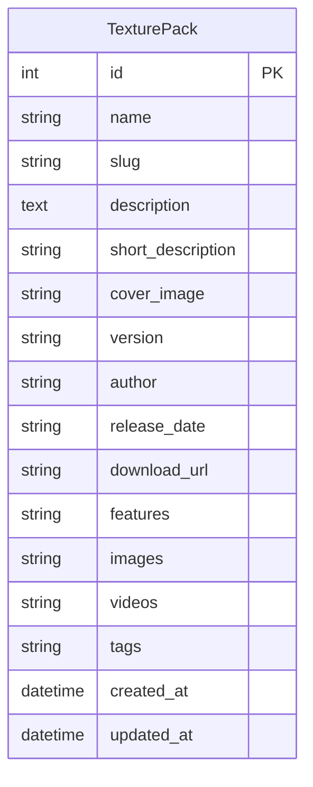

# QWQ 我的世界材质介绍页 - 技术架构文档

## 1. 架构设计

```mermaid
flowchart TD
    "客户端浏览器" --> "Next.js 前端应用"
    "Next.js 前端应用" --> "Next.js API 路由"
    "Next.js API 路由" --> "SQLite 数据库"
    "Next.js 前端应用" --> "Glass UI 组件库"
    "管理员" --> "后台管理页面"
    "后台管理页面" --> "API 路由（认证）"
```

## 2. 技术选型

| 层级 | 技术 | 说明 |
|------|------|------|
| 前端框架 | Next.js 14 (App Router) | React 框架，支持 SSR/SSG |
| UI 组件库 | Glass UI (shadcn/ui) | 玻璃质感组件库 |
| 样式 | Tailwind CSS | 实用优先的 CSS 框架 |
| 后端 | Next.js API Routes | 内置 API 路由 |
| 数据库 | SQLite (better-sqlite3) | 轻量级嵌入式数据库 |
| 认证 | 简单 Session/Token 认证 | 管理后台登录 |
| 图片/视频存储 | 本地 public 目录 | 开发阶段使用本地存储 |

## 3. 路由定义

### 3.1 前端路由
| 路由 | 页面 | 说明 |
|------|------|------|
| `/` | 首页 | 材质包列表展示 |
| `/texture/[id]` | 材质详情页 | 单个材质包详细介绍 |
| `/admin/login` | 管理员登录 | 后台登录页面 |
| `/admin` | 后台仪表盘 | 材质包管理列表 |
| `/admin/texture/[id]` | 编辑材质包 | 编辑材质包内容 |

### 3.2 API 路由
| 方法 | 路由 | 说明 |
|------|------|------|
| GET | `/api/textures` | 获取所有材质包列表 |
| GET | `/api/textures/[id]` | 获取单个材质包详情 |
| POST | `/api/textures` | 创建新材质包 |
| PUT | `/api/textures/[id]` | 更新材质包内容 |
| DELETE | `/api/textures/[id]` | 删除材质包 |
| POST | `/api/auth/login` | 管理员登录 |
| POST | `/api/auth/logout` | 管理员登出 |
| POST | `/api/upload` | 上传图片/视频文件 |

## 4. API 定义

### 4.1 材质包数据类型
```typescript
interface TexturePack {
  id: number;
  name: string;
  slug: string;
  description: string;
  shortDescription: string;
  coverImage: string;
  version: string;
  author: string;
  releaseDate: string;
  downloadUrl: string;
  features: string[];
  images: string[];
  videos: string[];
  tags: string[];
  createdAt: string;
  updatedAt: string;
}
```

### 4.2 请求/响应示例
```typescript
// GET /api/textures
// 响应
{
  "success": true,
  "data": TexturePack[]
}

// POST /api/textures
// 请求体
{
  "name": "QWQ 自然光影",
  "description": "...",
  "shortDescription": "...",
  "coverImage": "/uploads/cover.png",
  "version": "1.20",
  "author": "QWQ Team",
  "features": ["真实光影", "自然纹理"],
  "images": ["/uploads/img1.png"],
  "videos": ["/uploads/video1.mp4"],
  "tags": ["光影", "自然"]
}
// 响应
{
  "success": true,
  "data": TexturePack
}
```

## 5. 数据模型

### 5.1 ER 图


### 5.2 数据定义语言
```sql
CREATE TABLE texture_packs (
    id INTEGER PRIMARY KEY AUTOINCREMENT,
    name TEXT NOT NULL,
    slug TEXT NOT NULL UNIQUE,
    description TEXT DEFAULT '',
    short_description TEXT DEFAULT '',
    cover_image TEXT DEFAULT '',
    version TEXT DEFAULT '',
    author TEXT DEFAULT '',
    release_date TEXT DEFAULT '',
    download_url TEXT DEFAULT '',
    features TEXT DEFAULT '[]',
    images TEXT DEFAULT '[]',
    videos TEXT DEFAULT '[]',
    tags TEXT DEFAULT '[]',
    created_at DATETIME DEFAULT CURRENT_TIMESTAMP,
    updated_at DATETIME DEFAULT CURRENT_TIMESTAMP
);

CREATE TABLE admins (
    id INTEGER PRIMARY KEY AUTOINCREMENT,
    username TEXT NOT NULL UNIQUE,
    password_hash TEXT NOT NULL,
    created_at DATETIME DEFAULT CURRENT_TIMESTAMP
);
```

## 6. 项目目录结构
```
qwq-web/
├── app/
│   ├── layout.tsx          # 根布局
│   ├── page.tsx            # 首页
│   ├── texture/
│   │   └── [id]/
│   │       └── page.tsx    # 材质详情页
│   ├── admin/
│   │   ├── login/
│   │   │   └── page.tsx    # 后台登录
│   │   ├── page.tsx        # 后台仪表盘
│   │   └── texture/
│   │       ├── page.tsx    # 新建材质包
│   │       └── [id]/
│   │           └── page.tsx # 编辑材质包
│   └── api/
│       ├── textures/
│       │   ├── route.ts
│       │   └── [id]/
│       │       └── route.ts
│       ├── auth/
│       │   ├── login/route.ts
│       │   └── logout/route.ts
│       └── upload/route.ts
├── components/
│   ├── ui/                 # Glass UI 组件
│   ├── Navbar.tsx
│   ├── HeroSection.tsx
│   ├── TextureCard.tsx
│   ├── TextureGrid.tsx
│   ├── ImageGallery.tsx
│   ├── VideoPlayer.tsx
│   └── admin/
│       ├── Sidebar.tsx
│       ├── TextureForm.tsx
│       └── FileUpload.tsx
├── lib/
│   ├── db.ts
│   └── auth.ts
├── public/
│   └── uploads/
├── styles/
│   └── globals.css
├── package.json
├── tailwind.config.ts
├── tsconfig.json
└── next.config.js
```